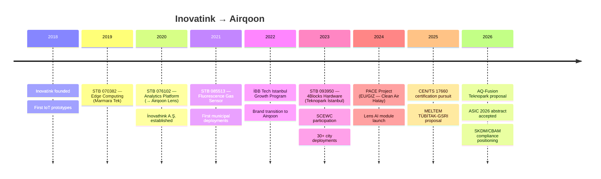

# Airqoon

> Full-stack environmental monitoring company — hardware manufacturing, cloud analytics, AI-powered reporting, and calibration services. 30+ cities across 5+ countries in EMEA.

---

## Identity

| Field | Value |
|-------|-------|
| **Legal Entity** | İNNOVATHİNK MÜHENDİSLİK SANAYİ VE TİCARET A.Ş. |
| **Brand** | Airqoon |
| **Type** | Full-stack IoT product & SaaS company |
| **Domain** | Air quality monitoring, environmental data intelligence, noise monitoring |
| **HQ** | Marmara Üniversitesi Teknoloji Geliştirme Bölgesi, Maltepe, Istanbul |
| **Tax Number** | 4780562315 |
| **Founded** | ~2018 (as Inovatink → İnovathink → Airqoon) |
| **Founders** | [[wiki/entities/baris-can-ustundag|Barış Can Üstündağ]] (Co-founder & CEO) |
| **Team** | Orhun Hazneci (technical/ops), Gülkan Güner (support/service) |
| **Teknopark Status** | ✅ Active — zero corporate tax advantage |
| **Certifications** | ISO 9001:2015, ISO/IEC 27001:2022 |
| **Active Markets** | Turkey (30+ cities), Azerbaijan, Iraq, Egypt (prospecting), Australia (prospecting), EU (France prioritised) |
| **Deployments** | 200+ sensor nodes, 20+ active customers |
| **Website** | [airqoon.com](https://airqoon.com) |

---

## Company Evolution

---

## Product Portfolio

### Hardware

| Product | Description | Key Specs |
|---------|-------------|-----------|
| **[[wiki/entities/unit-l|Unit L]]** | Flagship outdoor air quality sensor | 3.2 kg, IP65, solar-powered, 14-day battery, 4G/NB-IoT, PM1/2.5/10 + NO₂ + O₃ + SO₂ + CO + VOC + T/RH/P + noise + wind |
| **[[wiki/entities/unit-m|Unit M]]** | Indoor / compact unit | WiFi, noise monitoring, smaller form factor |
| **Unit N** | Planned next-gen unit | Details TBD |

**Sensors used:** Alphasense electrochemical (NO₂B43F, O₃A431, CO-B4, SO₂-B4), Sensirion SPS30 (PM), Sensirion SCD4x (CO₂), AethLabs MA350 (black carbon), Cubic Gasboard 2502 (CH₄/TDLAS), CESVA TA150 (Class 1 noise)

**Firmware:** ESP32-based, FreeRTOS, MQTT/TLS over port 8883. See [[wiki/sources/LCF|LCF]], [[wiki/sources/airqoon-su-fw|airqoon-su-fw]]

### Software

| Product | Description | See also |
|---------|-------------|----------|
| **[[wiki/entities/airqoon-lens|Airqoon Lens]]** | Enterprise analytics platform — dashboards, alarms, reports, data export, device comparison | [[wiki/sources/lens-api|lens-api]], [[wiki/sources/lens-ui|lens-ui]] |
| **Airqoon Lens AI** | GenAI-backed assessment reports, pollution source detection, trend analysis | Uses Anthropic Claude |
| **[[wiki/entities/airqoon-map|Airqoon Map]]** | Public real-time AQ map with citizen engagement, heatmaps, wildfire detection | 7 backend services |
| **Airqoon Brief** | Daily AQ intelligence for all 81 Turkish provinces | [brief.airqoon.com](https://brief.airqoon.com) |

> Full backend architecture: [[wiki/sources/airqoon-cloud-architecture|Cloud Architecture]]

### Infrastructure

| Component | Details |
|-----------|---------|
| **Hosting** | DigitalOcean Kubernetes (namespace: `airqoon`), Coolify (self-hosted), Proxmox VE (local) |
| **IoT Platform** | ThingsBoard PE 2.5.4 (prod) → 3.4.3 (migration target) |
| **Databases** | PostgreSQL, MongoDB, Cassandra (TB telemetry) |
| **Messaging** | RabbitMQ, AWS SQS (4 queues) |
| **Serverless** | AWS Lambda (hourly/daily statistics, nowcast, weather collector) |
| **Observability** | SigNoz via OpenTelemetry Collector |
| **CI/CD** | GitHub Actions, Docker, Helm, GitHub Container Registry |

---

## Value Proposition

1. **Cost leadership** — $2,500–5,500 vs >$8,000 for competitors; 40–60% savings
2. **Operational simplicity** — 5-minute deployment, modular sensor cartridges, 14-day battery backup
3. **Full-stack intelligence** — hardware + cloud analytics + AI reporting in one ecosystem
4. **Community engagement** — public map with citizen complaint collection (unique vs competitors)
5. **Regulatory readiness** — aligns with CEN/TS 17660, EU Directive 2008/50/EC, SKHKKY
6. **Domestic manufacturer** — 15% price advantage in Turkish public tenders (Law 4734)
7. **Teknopark tax advantage** — zero corporate tax under Teknopark status

---

## Customer Base

### Municipal Clients

| Customer | Scope |
|----------|-------|
| Bursa Büyükşehir Belediyesi | City-wide air quality monitoring network |
| Denizli Büyükşehir Belediyesi | Urban air quality monitoring |
| Kadıköy Belediyesi | Map export, polygon display, device management |
| Mudanya Belediyesi | Air quality monitoring |
| İnegöl Belediyesi | OSB-adjacent PM monitoring, [[wiki/sources/inegol_pm_presentation|İnegöl PM study]] |
| Avcılar Belediyesi | Air quality monitoring |

### Industrial Clients

| Customer | Sector | Context |
|----------|--------|---------|
| Akçansa | Cement | BCM/CNK regions, [[wiki/concepts/perimeter-monitoring|perimeter monitoring]] |
| Oyak Çimento | Cement | Industrial fenceline |
| Çimsa | Cement | EBRD/Çimsa Mersin tender pursued |
| Çimentaş | Cement | Perimeter monitoring |
| TÜPRAŞ | Refinery | Industrial monitoring |
| Enerjisa Üretim | Energy | Calibration reports, daily alerts, EBRD/IFC compliance |
| GİSAŞ | Industrial zone | Short-time monitoring, regulatory compliance |

---

## Distribution & Partnerships

**Active distributor network:**
- 🇪🇬 Egypt: HAK Automation, ELS, Gemica Engineering
- 🇸🇦 Saudi Arabia: REDA Safe
- 🇦🇺 Australia: Alpha Scientific, Connected IoT
- 🇪🇺 Europe: Codico, Calectro, Atlantik Elektronik, Casella Solutions
- 🇫🇮 Finland: Stick Wahlstrom
- 🇲🇾 Malaysia: BCN Smart Tech (Amir Shariff)

**Consulting/enterprise partnerships explored:** Bureau Veritas, DNV, TÜV SÜD, Deloitte, PwC, KPMG, EY, McKinsey, Arcadis

**Academic partners:** Prof. Dr. Ülkü Alver Şahin (İÜ-Cerrahpaşa), Prof. Fatma Öztürk (Boğaziçi/MELTEM), Assoc. Prof. Burçak Kaynak Tezel (İTÜ), University of Crete/GETMAP

---

## Key Projects & R&D

### Active / Recent

| Project | Type | Details |
|---------|------|---------|
| **[[wiki/sources/pace-projesi|PACE Projesi]]** | EU/GIZ | "Clean Air Hatay" — earthquake recovery air monitoring in 11 provinces, 10 pilot schools |
| **[[wiki/analyses/teknopark-aq-fusion-proposal|AQ-Fusion]]** | Teknopark R&D | Data fusion + dispersion modeling platform (proposed 2026) |
| **MELTEM** | TÜBİTAK-GSRI 2+2 | Bilateral project with Boğaziçi University + University of Crete |
| **GEFF Turkey** | Feasibility | Green finance study |
| **ASIC 2026** | Conference | Abstract accepted — spatiotemporal PM assessment in industrial cities |

### Completed (Teknopark STB)

| Code | Project | Teknopark | Key Output |
|------|---------|-----------|------------|
| 070382 | Akıllı Uç Bilişim | Marmara Tek | Edge computing for IoT devices |
| 076102 | Analiz ve Görselleştirme | Marmara Tek | → Airqoon Lens platform |
| 085513 | Floresans Sensör | Marmara Tek | Novel fluorescence-based gas sensor |
| 093950 | 4Blocks Donanım | Teknopark İstanbul | Modular IoT hardware architecture |

> Full details: [[wiki/sources/teknopark-previous-projects|Teknopark Previous Projects]]

---

## Competitive Landscape

> See: [[wiki/concepts/competitors|Competitors]], [[wiki/analyses/airqoon-vs-bettair|Airqoon vs Bettair]]

| Competitor | Positioning | Airqoon Advantage |
|------------|------------|-------------------|
| [[wiki/entities/bettair|Bettair]] | CEN/TS 17660 Class 1, "zero maintenance" cartridge model | Lower cost, full-stack (HW+SW), Turkey presence |
| [[wiki/entities/kunak-technologies|Kunak]] | MCERTS-certified, EU-focused | Cost advantage, local manufacturing, Map platform |
| [[wiki/entities/oizom|Oizom]] | Wide product range, India-based | Lens AI superiority, Map citizen engagement |
| Clarity Movement | US-focused, sensor analytics | Full dispersion modeling (AQ-Fusion roadmap) |
| BREEZE AERMOD | Static dispersion modeling | Real-time hybrid approach (AQ-Fusion roadmap) |
| Envirosuite | Enterprise hybrid platform | 70-90% cost advantage |

---

## Standards & Regulatory Framework

| Standard / Regulation | Relevance |
|----------------------|-----------|
| [[wiki/concepts/en17660-standard|CEN/TS 17660-1/2]] | Sensor performance evaluation — Class 1 certification pursued |
| EU Directive 2024/2881 | New PM2.5 limits (10 µg/m³), expanded indicative monitoring |
| SKHKKY | Turkish industrial air pollution control — HKKD reporting |
| HKDYY | Turkish air quality assessment limits |
| SKDM / CBAM | Carbon border adjustment — cement/steel monitoring demand |
| ESRS E1/E2 | EU sustainability reporting — pollution & emissions |
| TSRS 1/2 (KGK) | Turkish sustainability reporting — Scope 1/2/3 |
| IFC Performance Standard 3 | EBRD/IFC funded project requirements |
| ISO/IEC 17025 | Calibration lab accreditation (gap identified — no EU lab available) |

---

## Business Model

| Revenue Stream | Price Range | Notes |
|---------------|-------------|-------|
| Hardware (Unit L/M) | $2,500–5,500 | One-time sale or rental (~18 mo payback) |
| Lens Standard SaaS | $500–800/yr | Dashboard, alarms, reports |
| Lens Fusion (planned) | $3K–20K/yr | Dispersion modeling, source attribution |
| T1 Operations Service | ~$70/unit/yr | Maintenance baseline |
| Partner Commission | 20–25% rev | For sales partners |

**Pricing:** USD-denominated internationally; TRL for Turkish clients (currency risk absorbed). Rental model common in industrial sector.

**Funding:** Pre-seed/bootstrapped. ₺9M (~$200K) new investment under discussion.

---

## Content & Community

- **Airqoon Brief** — daily AQ intelligence for 81 provinces ([brief.airqoon.com](https://brief.airqoon.com))
- **Hava Sohbetleri** — YouTube podcast series ([playlist](https://www.youtube.com/playlist?list=PLDIc3QZJH-a7fly1rBL5GEkCNldEhdMkM))
- **Sales automation** — Apollo.io + n8n + Notion CRM + Ollama (qwen3:32b)

---

*See also: [[wiki/overview]], [[wiki/entities/unit-l|Unit L]], [[wiki/entities/airqoon-lens|Airqoon Lens]], [[wiki/entities/airqoon-map|Airqoon Map]], [[wiki/sources/airqoon-cloud-architecture|Cloud Architecture]], [[wiki/concepts/competitors|Competitors]], [[Oizom]]*
