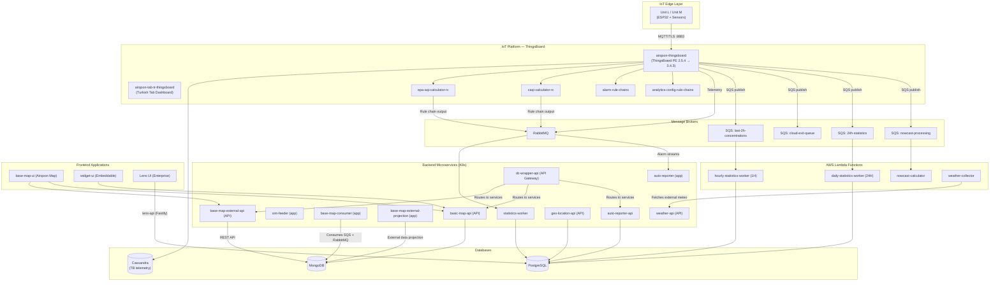

# Airqoon Cloud Architecture

This document synthesises the full cloud backend architecture from the company's internal architecture diagram, enriched with details from repository documentation and engineering notes.

---

## Architecture Overview

Airqoon's backend follows a **microservices architecture** deployed on **DigitalOcean Kubernetes** (namespace: `airqoon`), with legacy components running on **ThingsBoard PE** and serverless workloads on **AWS Lambda**. Data flows from IoT sensor units via MQTT into ThingsBoard, then fan out through message queues (RabbitMQ, AWS SQS) to specialised worker services, APIs, and frontends.

---

## Component Inventory

### IoT Platform — ThingsBoard

| Component | Description | Tech |
|-----------|-------------|------|
| **airqoon-thingsboard** | Core IoT platform. Receives MQTT telemetry from all field units, stores in Cassandra, triggers rule chains. | ThingsBoard PE 2.5.4 (prod) → 3.4.3 (migration target) |
| **airqoon-tab-tr-thingsboard** | Legacy Turkish-language ThingsBoard dashboard tab. | ThingsBoard UI extension |
| **Rule Chains** | `epa-aqi-calculator-rc` (US EPA AQI), `caqi-calculator-rc` (EU CAQI), `alarm-rule-chains`, `analytics-config-rule-chains` | ThingsBoard rule engine |

### Databases

| Database | Purpose | Notes |
|----------|---------|-------|
| **PostgreSQL** | Primary relational DB for Lens, statistics, alarms, reports, geo-location | Prisma ORM |
| **MongoDB** | Map platform data — telemetry snapshots, station configs, external stations | Used by base-map-* services |
| **Cassandra** | ThingsBoard time-series telemetry storage (raw sensor data) | Managed by TB internally |

### Message Brokers & Queues

| Broker | Queue | Consumer |
|--------|-------|----------|
| **RabbitMQ** | Telemetry + AQI streams | `statistics-worker`, `alarm-worker`, `auto-reporter` |
| **AWS SQS** | `last-2h-concentrations-queue` | `hourly-statistics-worker` (Lambda) |
| **AWS SQS** | `24h-statistics-queue` | `daily-statistics-worker` (Lambda) |
| **AWS SQS** | `nowcast-processing-queue` | `nowcast-calculator` (Lambda) |
| **AWS SQS** | `cloud-exit-queue` | External data export |

### AWS Lambda Functions

| Function | Purpose | Schedule |
|----------|---------|----------|
| **hourly-statistics-worker (1H)** | Computes hourly averages from raw telemetry | Triggered by SQS |
| **daily-statistics-worker (24H)** | Computes 24-hour rolling averages | Triggered by SQS |
| **nowcast-calculator** | Real-time NowCast AQI calculations | Triggered by SQS |
| **weather-collector** | Fetches external meteorological data from MGM/OpenWeather | Scheduled (cron) |

### Backend Microservices (Kubernetes)

| Service | Role | Tech Stack |
|---------|------|------------|
| **[[wiki/sources/airqoon-base-map-consumer\|base-map-consumer]]** | Consumes SQS + RabbitMQ telemetry, syncs to MongoDB, publishes to external APIs | Node.js |
| **[[wiki/sources/airqoon-data-external-projection\|base-map-external-projection]]** | Projects/transforms external station data into internal format | Node.js, Prisma |
| **[[wiki/sources/airqoon-base-map-external-api\|base-map-external-api]]** | High-performance REST API aggregating sensor data for the map platform | Node.js |
| **[[wiki/sources/airqoon-basic-map-api\|basic-map-api]]** | Fastify REST API for map services (widgets, station metadata) | Fastify, MongoDB |
| **[[wiki/sources/airqoon-sim-feeder\|sim-feeder]]** | Manages SIM card provisioning and connectivity for field units | Node.js |
| **statistics-worker** | Processes RabbitMQ streams, computes derived statistics | Python |
| **[[wiki/sources/airqoon-autoreporter\|auto-reporter (app)]]** | CLI generating multi-tenant air quality PDF/Markdown reports | Python, PostgreSQL, S3 |
| **auto-reporter-api** | HTTP API triggering auto-reporter jobs | Node.js |
| **dc-wrapper-api** | API Gateway — routes external requests to internal services | Node.js |
| **[[wiki/sources/airqoon-alarm-worker\|alarm-worker]]** | Evaluates alarm configurations against telemetry streams | Python, RabbitMQ, PostgreSQL |
| **geo-location-api** | Geocoding and reverse-geocoding for station placement | Node.js, PostgreSQL |
| **weather-api** | Internal API serving meteorological data | Node.js |

### Frontend Applications

| App | Product | Tech Stack |
|-----|---------|------------|
| **[[wiki/sources/airqoon-base-map-ui\|base-map-ui]]** | [[wiki/entities/airqoon-map\|Airqoon Map]] — public real-time air quality map | React, MapLibre GL JS |
| **[[wiki/sources/airqoon-widget-ui\|widget-ui]]** | Embeddable AQI widget carousel for 3rd-party sites | React |
| **[[wiki/sources/lens-ui\|lens-ui]]** | [[wiki/entities/airqoon-lens\|Airqoon Lens]] — enterprise analytics dashboard | React, TypeScript |

### Not Shown in Diagram (but part of ecosystem)

| Component | Role |
|-----------|------|
| **[[wiki/sources/lens-api\|lens-api]]** | Fastify API backend for Lens (reports, device mapping, AI features) |
| **[[wiki/sources/airqoon-aqi-calculator\|aqi-calculator]]** | Python AQI computation service (EPA, CAQI, custom) |
| **[[wiki/sources/airqoon-base-map-tile-server\|tile-server]]** | Vector tile server (.pbf) for map rendering |
| **[[wiki/sources/AirqoonCalibrationToolBackend\|Qoonify]]** | Calibration tool integrating IBB + ThingsBoard |
| **[[wiki/sources/acme_aq_simulator\|acme_aq_simulator]]** | Telemetry simulator for testing |
| **lens-mcp** | Model Context Protocol server for Lens AI |

---

## Data Flow Summary

1. **Ingestion:** Unit L/M → MQTT/TLS → ThingsBoard → Cassandra (raw telemetry)
2. **Processing:** ThingsBoard rule chains calculate AQI (EPA/CAQI), trigger alarms → push to RabbitMQ + SQS
3. **Statistics:** SQS → Lambda workers (hourly, daily, nowcast) → PostgreSQL (aggregated stats)
4. **Map Platform:** base-map-consumer syncs telemetry → MongoDB → base-map-external-api serves to base-map-ui
5. **Lens Platform:** lens-api reads PostgreSQL → lens-ui renders dashboards, reports, AI insights
6. **Reporting:** auto-reporter reads PostgreSQL → generates PDF/Markdown → stores in S3
7. **Alarms:** alarm-worker reads RabbitMQ streams → evaluates rules → creates alarm instances + notifications

---

## Infrastructure Notes

- **Hosting:** DigitalOcean Kubernetes (namespace: `airqoon`), Coolify (self-hosted utilities), Proxmox VE (local)
- **Reverse Proxy:** Traefik (current) / HAProxy (legacy)
- **Storage:** Garage S3 (self-hosted), AWS S3 (reports)
- **Observability:** SigNoz via OpenTelemetry Collector
- **Auth:** Keycloak (under evaluation)
- **CI/CD:** GitHub Actions, Docker, Helm
- **Known Issue:** ThingsBoard 2.5.4PE sends non-spec MQTT headers (flags 0x02 on PUBACK/SUBACK) — migration to 3.4.3 planned via DNS flip on `see.airqoon.com`

---

*See also: [[wiki/entities/airqoon-lens|Airqoon Lens]], [[wiki/entities/airqoon-map|Airqoon Map]], [[wiki/sources/claude-programming-memory|Programming Memory]]*
